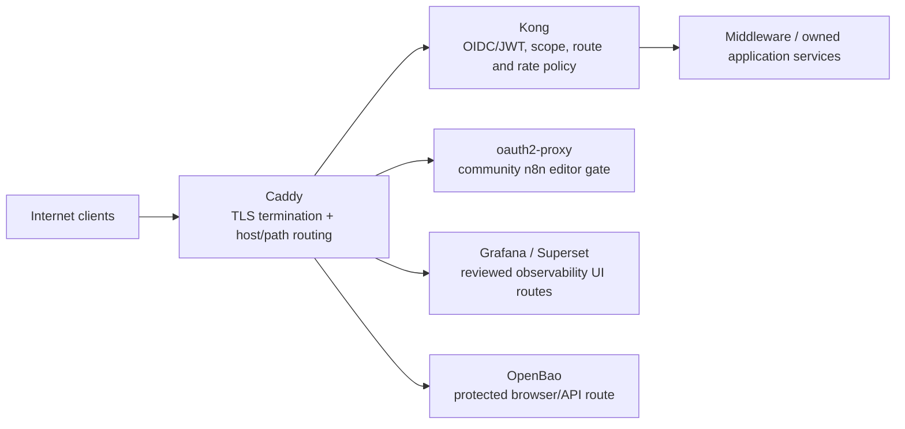
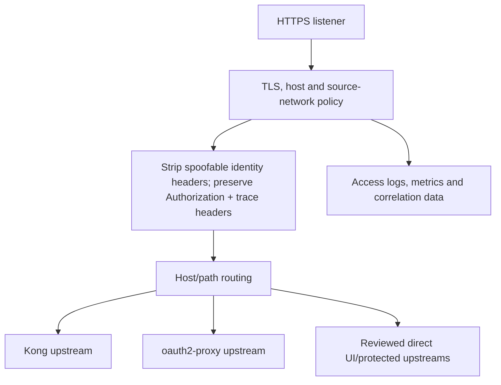
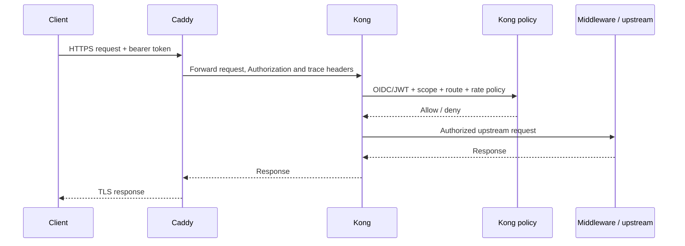
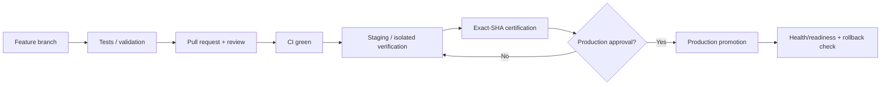
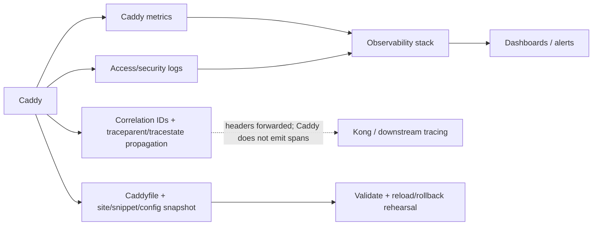

# Caddy — Architecture Charts

> Repository: `appolon1908/Caddy`
> Baseline branch: `main`
> Repository-local visual architecture. Keep these diagrams aligned with code, contracts and deployment.

## 1. System context

## 2. Internal component architecture

## 3. Critical runtime flow

## 4. Deployment and promotion

## 5. Observability and recovery

## Ownership notes
- **Role:** Public TLS edge and reverse proxy
- **Primary boundary:** TLS termination, host/path/source-network policy and proxy handoff; application authentication remains downstream.
- **State/config:** Caddyfile, site blocks, snippets and edge contracts.
- **Dependencies/consumers:** Kong, oauth2-proxy, Grafana, Superset, OpenBao and explicitly reviewed upstreams.
- Caddy preserves bearer and trace headers for downstream policy; it does **not** claim an application tracing exporter.
- Cross-repository effects must use reviewed contracts; production effects remain separately gated.
