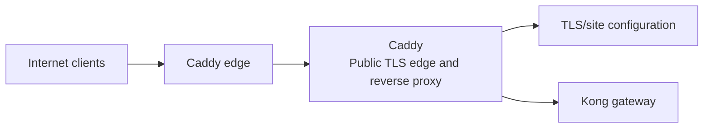
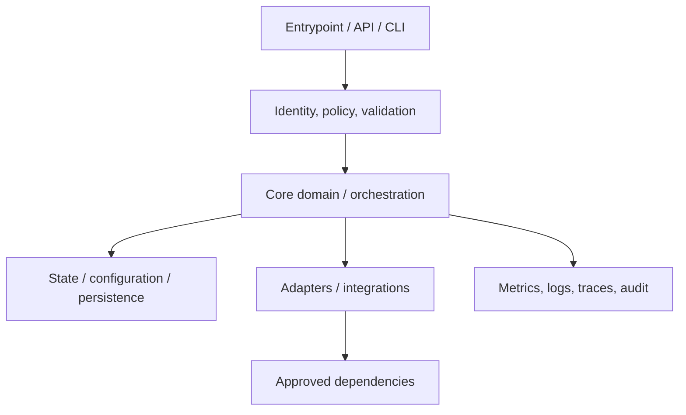
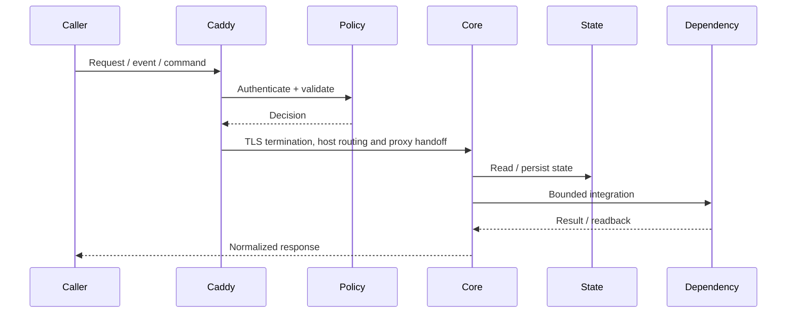
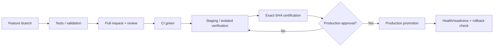
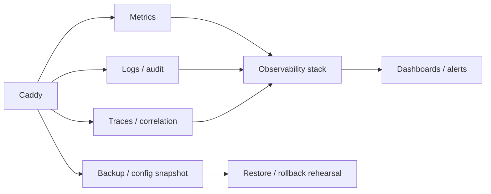

# Caddy — Architecture Charts

> Repository: `appolon1908/Caddy`  
> Baseline branch: `main`  
> Repository-local visual architecture. Keep these diagrams aligned with code, contracts and deployment.

## 1. System context

## 2. Internal component architecture

## 3. Critical runtime flow

## 4. Deployment and promotion

## 5. Observability and recovery

## Ownership notes
- **Role:** Public TLS edge and reverse proxy
- **Primary boundary:** Caddy edge
- **State/config:** TLS/site configuration
- **Dependencies/consumers:** Kong gateway
- Cross-repository effects must use reviewed contracts; production effects remain separately gated.
